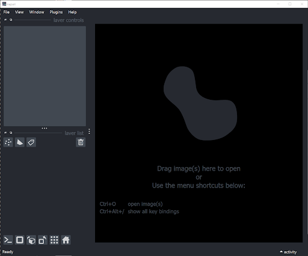

# Virtual environments, and installing napari

## Creating a virtual environment

- We’ll now create a virtual environment and install Python into it, in one step. The name of this environment is up to our choosing and does not necessarily need to be the same as below. For this example, we’ll be creating a virtual environment called **“napari-env”** to install napari into. However, *outside of the environment’s name, the exact syntax needs to be followed*. You can ensure this by hitting the enter key after typing. 

  - **conda create -y -n *napari-env* -c conda-forge python=3.9**

- After hitting the enter key, the virtual environment will be created and Python installed into it.

:::{note} 
For the purposes of this tutorial, it is not necessary to understand the nature of the syntax we’ll be using. However, it is critical, unless otherwise mentioned, that you copy the command syntax exactly as you see it here. 
:::

- While the virtual environment **“napari-env”** has been created, it has not been activated yet. You can tell this as **“(base)”** is still indicated at the command line:  

- To activate the virtual environment:

  - **conda activate *napari-env***

- **“(napari-env)”** should now be indicated at the command line:

## Installation of napari 

- To install napari into the activated environment:

  - **conda install -c conda-forge napari**

- This may take some time (a few minutes), and may reach a point where a user input is required to continue as dependencies are checked. If this is the case, the following will be displayed:

  - **Proceed ([y]/n)?**

- You can either type **y**, then enter, or simply enter.
- This may again take a few minutes to get all the requisite packages downloaded, extracted, and executed.
- At this point, you will be again returned to the prompt indicating the virtual environment you’ve just installed napari into.
- To launch napari, simply type the one word command below, followed by the enter key:
  - **napari**
- In a few seconds, the napari viewer window should be displayed:

- You have now successfully installed napari onto a Windows machine!

## Launching napari after installation session

- Now that you have completed installation, the procedure for launching napari going forward will be as follows:

1. Launch “anaconda prompt (miniconda3)”
2. Activate the virtual environment you’ve created and installed napari into:
  - **conda activate napari-env**
3. Launch napari:
  - **napari**
