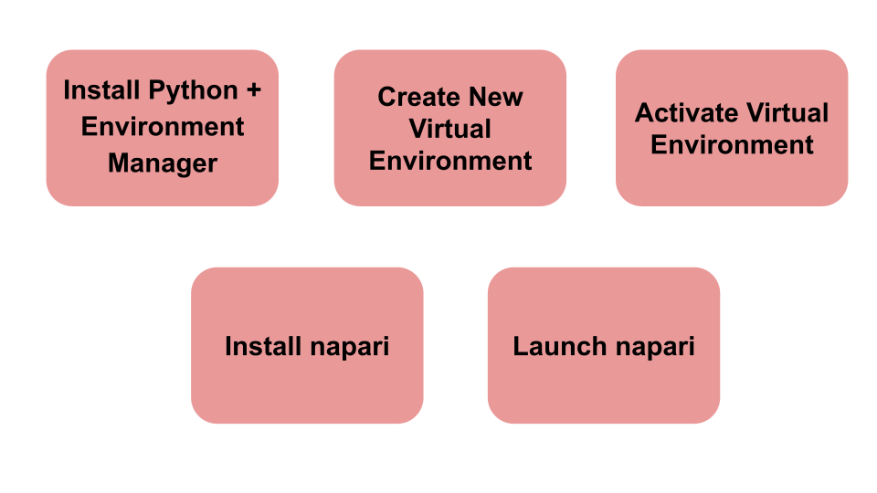
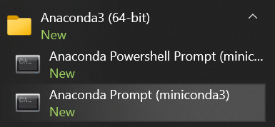

Getting started with napari and plugins
=======================
**By [Bryan Millis](https://chanzuckerberg.github.io/napari-segmentation-workshop/preface/whomadethis.html#bryan-millis) 🔬**
## Learning Objectives

In this lesson, you'll learn how to install napari with *minimal coding*, how virtual environments tie into installation, and launching napari for the first time. 

1.  [Installation flowchart](https://chanzuckerberg.github.io/napari-segmentation-workshop/onboard/gettingstarted.html#installation-flowchart)
2.  [Video walkthrough of installing napari](https://chanzuckerberg.github.io/napari-segmentation-workshop/onboard/gettingstarted.html#video-walkthrough)
3.  [Background: Python and napari](https://chanzuckerberg.github.io/napari-segmentation-workshop/onboard/gettingstarted.html#installation-of-python-via-an-environment-manager)
4.  [Background: Virtual environments and environment manager](https://chanzuckerberg.github.io/napari-segmentation-workshop/onboard/gettingstarted-2.html#creating-a-virtual-environment)
5.  [Steps to install miniconda, an environment manager](https://chanzuckerberg.github.io/napari-segmentation-workshop/onboard/gettingstarted-2.html#creating-a-virtual-environment)
6.  [Steps for creating and using a new virtual environment](https://github.com/chanzuckerberg/napari-segmentation-workshop/blob/main/content/onboard/gettingstarted-2.md#creating-a-virtual-environment)
8.  [Steps for installing napari](https://chanzuckerberg.github.io/napari-segmentation-workshop/onboard/gettingstarted-2.html#installation-of-napari)
9.  [How to launch napari](https://chanzuckerberg.github.io/napari-segmentation-workshop/onboard/gettingstarted-2.html#launching-napari-after-installation-session)
10.  [Plugins Overview](https://chanzuckerberg.github.io/napari-segmentation-workshop/onboard/gettingstarted-3.html#)
11.  [How to install napari plugins](https://chanzuckerberg.github.io/napari-segmentation-workshop/onboard/gettingstarted-3.html#plugin-installation-tutorial)

- **Time to learn**: 1 hour

## Installation flowchart

Here is an overview of all of the steps for installing napari in the recommended way using an environment manager. An environment manager allows you to create multiple virtual environments, like separate sandboxes, on your computer for installing programs, like napari, without affecting other parts of your system. Below is a visual example of a computer with 3 separate environments, named **napari-cell**, **napari-env**, and **napari-clean**, each with a separate installation of napari along with one or more plugins. More on managing environments and installation next.

## Video walkthrough

## Background: Python and napari

Like every software package out there, napari is written with a programming language. For example, Windows is based in *C*, various statistics programs are written in *R*, and ImageJ is based on *Java*. Napari is written with a language called *Python*. 

Python is a widely popular scientific computing language with many years of contributions under its belt. As such, there are multitudes of tools (and algorithms) that a program like napari can leverage to accomplish its tasks. Python, by default, does not always come pre-installed   on computers, and one needs to manually install it in order to execute Python-based programs.  

Although this is likely to change in the future, there is no “quick install” of napari (and its requisite Python coding language). Here we walk through the steps necessary for doing so, including getting Python installed on your machine, and subsequently the individual commands necessary for installing napari itself. This particular tutorial will focus on installing the aforementioned on a Windows machine. 

## Background: Virtual environments and environment manager

To be clear, there are several ways one could install Python on your machine. For example, one could visit the [Python website](https://www.python.org/) to install solely the Python language itself. However, we can install Python along with an **environment manager**, which is the recommended prerequisites installing napari.  

The environment manager is called “miniconda”— a lightweight distribution of a bigger package called conda. Miniconda installs Python along with a few essential packages and is a **package manager** that enables creating and managing virtual environments. 

A virtual environment can be summed up as a contained place, or sandbox, where both a program and its various dependencies (i.e. other related files required for elements of a program to run) are installed. Having such a place available is extremely helpful, especially when using programs in active development, as environments can be created and deleted at will (if for example, there was a corruption, or bug that was hard to track down you could simply delete the environment and continue in a new environment with a fresh install).

## Steps to install miniconda

- Visit the official [conda site](conda.io).
- Locate the link for miniconda. 

- Select the appropriate Miniconda installation for your computer (in this example case, the Windows 64-bit installation is highlighted). For mac users, download the pkg file associated with your processor (This can be checked by going to Apple menu > About This Mac. For Intel processors, download the x86 file, and for ARM processors, download the Apple M1 file.).

:::{hint} 
Note the current version of Python that will be installed also. Below, this is listed as “Python 3.9.7”.  Typically, if one wants a previous version of Python installed, alternative links will be available further down on the page.
:::

- Once the download has finished, run it. Default installation options are typically sufficient.
- The next steps for opening a terminal for installing napari differ for Mac and Windows users. For Windows users, click on the lower left windows icon (Windows 10) and either type **“anaconda…”** (in which case it will find "**Anaconda Prompt (miniconda3)"**), or scrolling down to the anaconda folder and finding it. For Mac users, simply open **terminal** using spotlight search.

- This launches the command prompt (Windows) or terminal (Mac) into the **“base environment”** (as denoted by **“(base)”** at the start of the command line). We'll use these terminals for creating virtual environments and installing napari.

:::{hint} 
If you plan on running napari on a regular basis, it may be handy at this point to create a shortcut to the Anaconda Prompt, or pin it to your taskbar, for easy access.
:::
