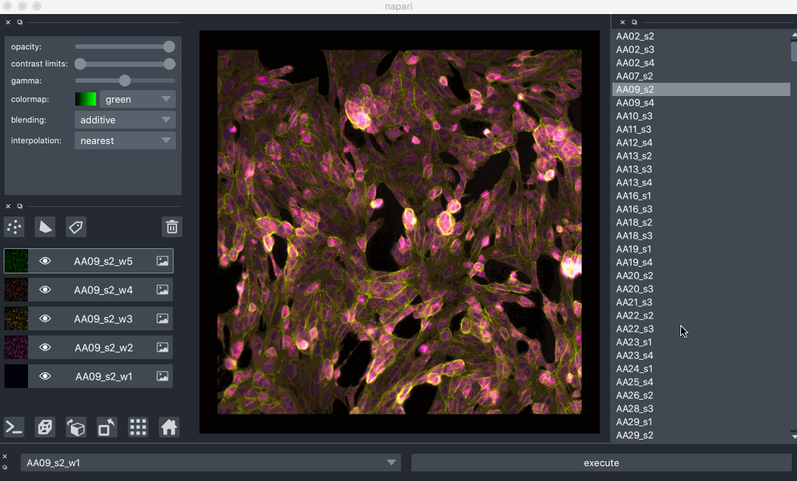

What is napari?
=======================
**By [Caron Jacobs](https://chanzuckerberg.github.io/napari-segmentation-workshop/preface/whomadethis.html#caron-jacobs) 🔬**
## Learning Objectives

This is a brief introduction to napari geared towards people without coding experience in the context of the no-code workflows later on in the course. In this lesson, you'll learn what [napari](https://www.napari.org) is, its relationship with the Python coding language, and some of the advantages of using open-source imaging tech. 

1.  [What is napari?](https://chanzuckerberg.github.io/napari-segmentation-workshop/onboard/whatisnapari.html#what-is-napari)
2.  [The power of Python](https://chanzuckerberg.github.io/napari-segmentation-workshop/onboard/whatisnapari.html#the-power-of-python)
3.  [Interoperability of napari](https://chanzuckerberg.github.io/napari-segmentation-workshop/onboard/whatisnapari.html#interoperability-of-napari)
4.  [Supporting materials](https://chanzuckerberg.github.io/napari-segmentation-workshop/onboard/whatisnapari.html#supporting-materials)

- **Time to learn**: 20 minutes

:::{note}
Please check [napari documentation](https://napari.org/tutorials/start_index.html) for more information, especially related to napari usage with programming. There are many aspects of napari's capabilities that are not currently accessible without programming. Although parts of napari are still undergoing development and some kinks are still being ironed out, napari is a powerful tool for image analysis, especially for complex, large, or multi-dimensional datasets.
:::

---

## What is napari

Napari is an open-source **graphical user interface**[^mynote], developed for viewing, annotating, and analysing large and multi-dimensional imaging datasets. 

[^mynote]: Any program you can interact with in a separate window, equipped with clickable buttons, built-in tools, and other visual mechanisms.

Napari is free-to-use, **open-source** and **community-developed**. This means that napari’s arsenal of tools will continue to develop in tandem with the needs of its users and as new technologies and methodologies become available. These tools are made available as napari **plugins**[^mynote2] installable extensions that add capabilities to napari like the ability to open a new image type or do segmentation tasks. 

[^mynote2]: Installable add-ons for the napari viewer which enhance its image analysis capabilities. Discoverable in the napari viewer or the [napari hub](https://www.napari-hub.org). 

Napari aims to minimize (and eventually eliminate) the amount of coding knowledge needed for its use, making it friendly for researchers in life-science based fields. However as napari is still being developed and evolving as a platform, the current version (as of June 2022) requires some user understanding of the basics of: **conda**, **Python**, and **virtual environments**. These concepts will be explained in subsequent sections, where you will be guided through installing napari. Core developers are building a stable app version of napari that can be installed like other desktop apps without using code. 

:::{hint}
Although the [napari bundled app](https://napari.org/stable/tutorials/fundamentals/installation.html#install-as-a-bundled-app) already exists, it is still in-development and not entirely stable. We recommend [installing napari as a Python package](https://napari.org/stable/tutorials/fundamentals/installation.html#prerequisites-for-installing-napari-as-a-python-package) if you intend to perform cell segmentations. This note will be updated as napari evolves.
:::

## The power of Python

Large datasets produced by modern imaging technologies (such as time lapse imaging, confocal microscopy, super-resolution microscopy, or light sheet microscopy) can be challenging for legacy tech to handle and analyze. Sophisticated methods are needed for analysing this data and often these methods utilize programming languages such as Python, which is an open-source language with many capabilities for image analysis provided by its numerous open-source packages (also called libraries). However, without coding experience, researchers have limited options for utilizing the image processing power of Python. Graphical user interfaces (GUIs), like napari, are a way to utilize Python-based analysis methods without writing any code.

:::{hint}
Napari’s utility is certainly not limited to handling large datasets. The Python basis of napari means that many useful packages can be made available for a range of simple or complex data processing and analysis tasks.
:::

Napari is built on the Python coding language, intending to bridge the gap between the inherently visual nature of image analysis and the computational power available through Python and its packages. This includes, for example, being able to leverage the speed of GPU-based computing and machine learning for large and complex processes, such as content-aware denoising, handling of light-sheet microscope data, or even challenging segmentation cases! 

## Interoperability of napari

Napari is also interoperable with other image analysis platforms, such as [FIJI](https://imagej.net/software/fiji/). Check out these plugins for using napari with FIJI. Since napari is in the alpha stage of development, there are some functions that are not yet stable or available in the GUI of napari, so napari can be used in conjuction with other analysis platforms for no-code workflows.

## Supporting materials

### Napari documentation

- [Napari.org 'Quick Start'](https://napari.org/tutorials/fundamentals/quick_start.html)

### Community pages for napari

- [CZI napari landing page](https://chanzuckerberg.com/napari-a-multi-dimensional-image-viewer-for-python/)
- [Image.SC forum for napari](https://forum.image.sc/tag/napari)

### Introduction from a napari core developer

 
<iframe width="560" height="315" src="https://www.youtube.com/embed/VXdFOcBCto4" title="YouTube video player" frameborder="0" allow="accelerometer; autoplay; clipboard-write; encrypted-media; gyroscope; picture-in-picture" allowfullscreen></iframe>
  

