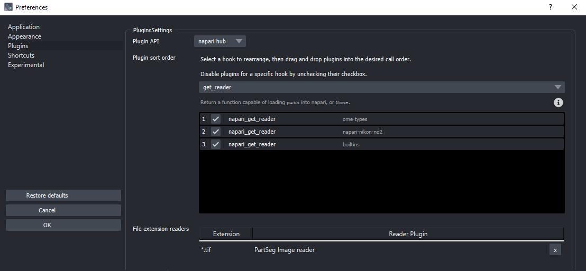
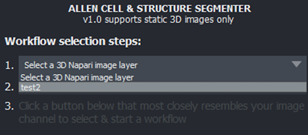
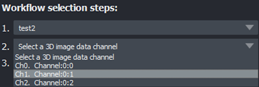
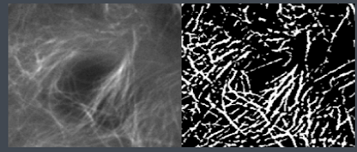
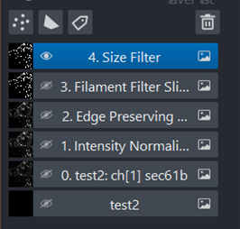
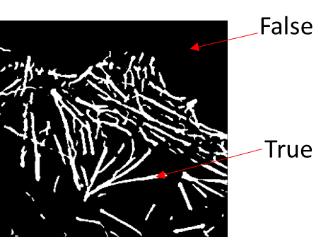

# Protocol for segmentation workflow

## Launch napari and import your image

- Begin by importing an image to be analyzed. Drag and drop your image directly into the napari viewer, or locate it on your computer using the main menu **File > Open**. 

- Ensure that the built-in reader plugins are being used, to minimize errors. Verify, under  **File>Preferences>Plugins**, that the *get_reader* plugins are enabled. There is a check in the box on the left end of the line if they are, as shown here:  

      

- In this instance, an image of *actin filaments* is open (which you can download for yourself [here](https://github.com/chanzuckerberg/napari-segmentation-workshop/raw/main/content/workflow/images/Allen-Cell-Segmenter-Sample-Data.tif)).  
    
:::{hint}
Right click on the playback button on the left end of the slider bar under the image to change the speed at which the image is shown. It can be slowed down to one frame/second. Right click on the `contrast limits:` slider and adjust the upper contrast limit to about 62 to see the image better. 
:::

## Protocol

#### Open Allen Cell Segmenter Workflow editor

- With the image loaded, go to the menu: **Plugins > napari-allencell-segmenter > Workflow editor**. 

#### Select the image to segment

- In the **Workflow selection steps** window that appears, click the first drop down menu (#1), then select the image you imported previously. 

#### Select the channel to segment

- Moving to the dropdown menu below (#2), select the channel of your image that you wish to segment. 

#### Select a comparable reference 

- In the final dropdown menu (#3), choose an image from the reference library that most closely matches the image you've selected to segment and analyze.

- Using our [sample data](https://github.com/chanzuckerberg/napari-segmentation-workshop/raw/main/content/workflow/images/Allen-Cell-Segmenter-Sample-Data.tif), we'll choose the last image in this library since it most closely matches our own imported image. 

- Now that a reference image and its associated workflow have been selected, Allen Cell will create a duplicate of your image. 

- The workflow is split into 3 parts: **pre-processing**, which normalizes the intensity of and and smoothens your image, **segmentation**, and **size filtering** with a 2D and 3D pixel linkage mode. 

:::{hint}
All the intermediate steps between each part of a workflow are displayed as layers on the left side, with numbers that correspond to the numbered steps in the workflow.

:::

## Post-segmentation resulting image

- After the segmentation step has been completed, your 'image' becomes a **true/false array**. 
 

- Your 'image' now needs to be converted into a **binary** (0/1 or 0/255) **mask** if it is to be exported. You can easily convert it into a binary mask by right-clicking the layer in question and selecting **convert image to labels** from the menu that appears. Any layer can be converted into labels but in this case we mean the Size Filter layer. 
